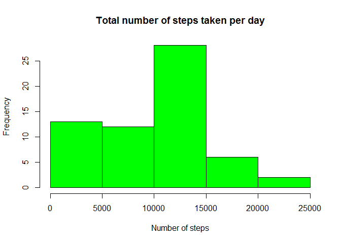
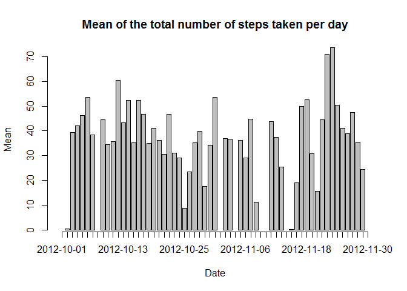
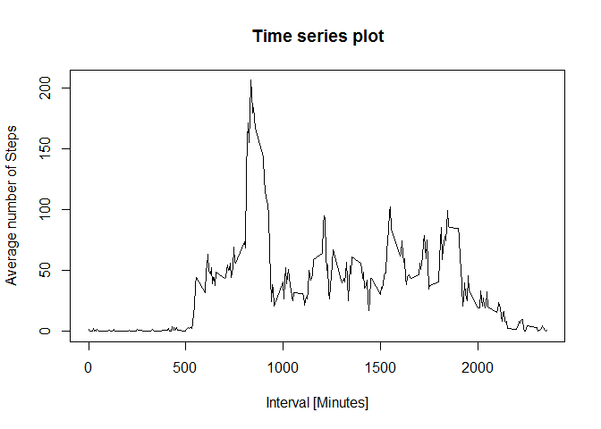
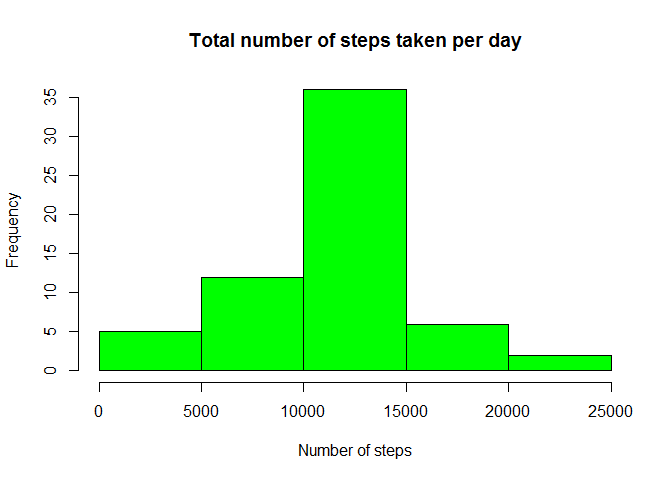
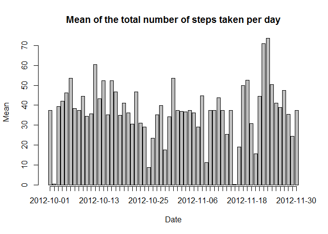
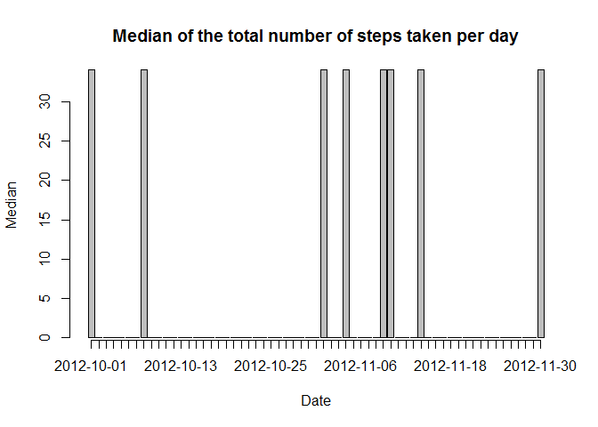

# Reproducible Research: Peer Assessment 1


Packages needed.

```r
library(lubridate)
library(lattice)
```


## Loading and preprocessing the data


1. Load data

```r
path <- "./activity/activity.csv"
mydata <- read.csv( path )
mydata$date <- as.Date( mydata$date )
```


2. Transform the date column to a Date object.

```r
mydata$date <- as.Date( mydata$date )
```


## What is mean total number of steps taken per day?


1. Calculate the total number of steps (stepsByDay) taken per day

```r
stepsByDay <- aggregate(x=mydata["steps"], by=list(mydata$date), FUN=sum, na.rm=TRUE)
names(stepsByDay)[1]<-"date"
```


2. Make a histogram of the total number of steps taken each day

```r
hist(stepsByDay$steps, main="Total number of steps taken per day", xlab="Number of steps", col="green")
```

 


3. Calculate and report the mean and median of the total number of steps taken per day

Mean:

```r
stepsByDay_mean<- aggregate(x=mydata["steps"], by=list(mydata$date), FUN=mean, na.rm=TRUE)
names(stepsByDay_mean)[1]<-"date"
mp <- barplot(stepsByDay_mean$steps, main="Mean of the total number of steps taken per day", xlab="Date", ylab="Mean")
axis(1,at=mp,labels=stepsByDay_mean$date)
```

 

Median:

```r
stepsByDay_median <- aggregate(x=mydata["steps"], by=list(mydata$date), FUN=median, na.rm=TRUE)
names(stepsByDay_median)[1]<-"date"
mp <- barplot(stepsByDay_median$steps, main="Median of the total number of steps taken per day", xlab="Date", ylab="Median")
axis(1,at=mp,labels=stepsByDay_median$date)
```

 


## What is the average daily activity pattern?


1. Make a time series plot (i.e. type = "l") of the 5-minute interval (x-axis) and the average number of steps taken, averaged across all days (y-axis)

```r
stepsByInterval <- aggregate(x=mydata["steps"], by=list(mydata$interval), FUN=mean, na.rm=TRUE)
names(stepsByInterval)[1] <- "interval"
plot(x=stepsByInterval$interval, y=stepsByInterval$steps, type="l", xlab="5 minutes Interval", ylab="Average number of Steps", main="Time series plot")
```

 


2. Which 5-minute interval, on average across all the days in the dataset, contains the maximum number of steps?

```r
subset(stepsByInterval, stepsByInterval$steps==max(stepsByInterval$steps))
```

```
##     interval    steps
## 104      835 206.1698
```


## Inputing missing values


1. Calculate and report the total number of missing values in the dataset (i.e. the total number of rows with NAs)

```r
length( ( which( is.na( mydata$steps ) ) ) )
```

```
## [1] 2304
```


2. Devise a strategy for filling in all of the missing values in the dataset. 

*The strategy devised fills all the missing values in the dataset with the mean for that 5-minute interval*.

3. Create a new dataset (newdata) that is equal to the original dataset but with the missing data filled in.

```r
newdata <- mydata

myfunc <- function(x) {
  for(i in 1:nrow(x) ){
		aux <- x[i,1:3]
		if( is.na( aux$steps )==TRUE )
			x$steps[i] <- stepsByInterval[i,2]
	}
	return(x)
}
		   
mydfs <- split(mydata,mydata$date)

newdata <- unsplit( lapply(mydfs, myfunc), mydata$date )
newStepsByDay<- aggregate(x=newdata["steps"], by=list(newdata$date), FUN=sum, na.rm=FALSE)
names(newStepsByDay)[1]<-"date"
```

4. Make a histogram of the total number of steps taken each day and Calculate and report the mean and median total number of steps taken per day. Do these values differ from the estimates from the first part of the assignment? What is the impact of inputing missing data on the estimates of the total daily number of steps?


```r
hist(newStepsByDay$steps, main="Total number of steps taken per day", xlab="Number of steps", col="green")
```

 

Mean:

```r
stepsByDay_mean <- aggregate(x=newdata["steps"], by=list(newdata$date), FUN=mean)
names(stepsByDay_mean)[1]<-"date"
mp <- barplot(stepsByDay_mean$steps, main="Mean of the total number of steps taken per day", xlab="Date", ylab="Mean")
axis(1,at=mp,labels=stepsByDay_mean$date)
```

 

Median:

```r
stepsByDay_median <- aggregate(x=newdata["steps"], by=list(newdata$date), FUN=median)
names(stepsByDay_median)[1]<-"date"
mp <- barplot(stepsByDay_median$steps, main="Median of the total number of steps taken per day", xlab="Date", ylab="Median")
axis(1,at=mp,labels=stepsByDay_median$date)
```

 

*The values definitely differ from the estimates from the first part of the assignment*. 

*Missing data reduce the representativeness of the sample and can therefore distort inferences about the dataset*.


## Are there differences in activity patterns between weekdays and weekends?

1. Create a new factor variable in the dataset with two levels - "weekday" and "weekend" indicating whether a given date is a weekday or weekend day.

```r
datetype_func <- function(x){
  tmp <- wday(x)	
	if( tmp>1 && tmp<7 )
		x<-"weekday"
	else
		x<-"weekend"
	return(x)
}
newdata$type_date <- factor( sapply(newdata$date, datetype_func) )

stepsByType_date<- aggregate(x=newdata["steps"], by=list(newdata$interval, newdata$type_date), FUN=mean, na.rm=TRUE)
names(stepsByType_date)[1] <- "interval"
names(stepsByType_date)[2] <- "typeOfDay"
```


2. Make a panel plot containing a time series plot (i.e. type = "l") of the 5-minute interval (x-axis) and the average number of steps taken, averaged across all weekday days or weekend days (y-axis).

```r
xyplot(steps ~ interval | typeOfDay, data = stepsByType_date, layout = c(1, 2), type="l")
```

 
